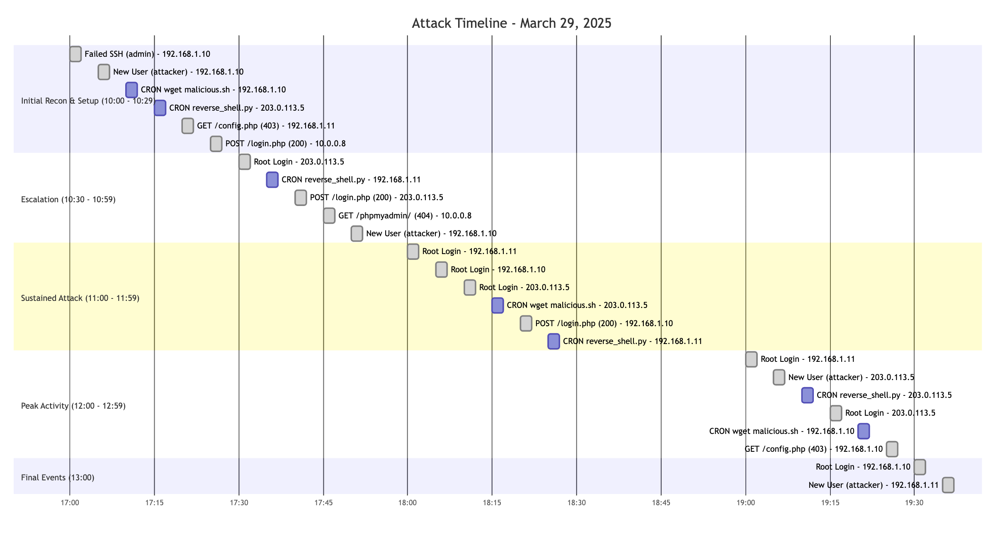

# Log Analysis Case Study: Honeynet Project

Made by:  

6633124421   Nunnapat Peeranoppawat   
6633058721   Napak Jesdaapiban  
6633038121   Jaitnipat Wichitniti  
6633261721   Sirawit chanaburanasak  

# Part 1: Initial Reconnaissance and Entry Point 

### First timestamp of suspicious activitiy  
- The first timestamp activity is 29/Mar/2025:10:00:00Z by starting a CRON job for downloading `malicious.sh`

### Attacker IP address
- I find 203.0.113.5 is the actual public ip address of the attacker all others are private ip addresses
- The private ip address which hacker has accessed to our network is 192.168.1.10, 192.168.1.11, 10.0.0.8

### Reconnaissance techniques
- *Directory and Resource Scanning*: The attacker trying to access the `/admin`, `/phpmyadmin`, `login.php`  path which is not a common path in the website.
- *SSH brute force attempts*: Multiple Failed password for invalid user admin entries
- *Testing access permissions* (seeing what returns 403 Forbidden vs 404 Not Found)
- *Login page testing*: POST /login.php HTTP/1.1 with 200 responses indicating successful attempts
- *Testing default credentials*: Attempts to log in as "admin" user

### Vulnerabilities was exploited by weak credentials
- At the start of the timestamp the attacker was already in the system as the `cron job` was already added and the `malicious script` was already downloaded
- The attacker trying to brute force the password of the admin user
```zsh
Failed password for invalid user admin from 203.0.113.5 port 45678 ssh2
Failed password for invalid user admin from 192.168.1.10 port 45678 ssh2
Failed password for invalid user admin from 192.168.1.11 port 45678 ssh2
Failed password for invalid user admin from 10.0.0.8 port 45678 ssh2
```
- The attacker trying to brute force the password of the root user and successfully logged in
```zsh
Accepted password for root from 203.0.113.5 port 54321 ssh2
Accepted password for root from 192.168.1.10 port 54321 ssh2
Accepted password for root from 192.168.1.11 port 54321 ssh2
```

# Part 2: Privilege Escalation and Persistence 

### Login attempt in auth.log
```zsh
Mar 29 10:21:03 honeypot sshd[1234]: Accepted password for root from 192.168.1.11 port 54321 ssh2
```
- The attacker succesfully logged in as root user

### Suspicious users added
```zsh
Mar 29 10:22:15 honeypot useradd[1235]: new user: name=attacker, UID=1001, GID=1001
```
- The attacker created a new user called `attacker`

### Cron Job
```zsh
CRON job added by attacker
CRON job started: wget malicious.sh
```
### Malicious script
- The attacker added a cron job to download a malicious script
```zsh
CRON executed reverse_shell.py
```
The attacker executed a script called `reverse_shell.py`

# Part 3: Post-Exploitation and Network Behavior 

### Communication with known Command & Control (C2) server
```zsh
192.168.1.11 -> 10.0.0.5:443 (C2)
192.168.1.11 -> 10.0.0.6:80 (HTTP Download)
```

### C2
- The attacker is using a C2 server to control the compromised machine
- The C2 server is at `10.0.0.5:443`

### HTTP Download
- The attacker is downloading a file from `10.0.0.6:80`

### Malicious script
```
Mar 29 10:25:01 CRON[1236]: (attacker) CMD (/usr/bin/python3 /tmp/reverse_shell.py)
```
- The attacker is executing a script called `reverse_shell.py` as a cron job

# Part 4: Indicatiors if Compromise

### IP Addresses
- The first 3 addresses are private IP which means they are likely compromised device. 
```zsh
- 192.168.1.10
- 192.168.1.11
- 10.0.0.8
- 203.0.113.5
```

### Suspicious files
- `malicious.sh` - Malicious script executed by the attackers
assumed to be a download script from the attacker's C2 server
```zsh
"timestamp": "2025-03-29T10:00:00Z", "log_type": "cron", "client_ip": "192.168.1.10", "event": "CRON job started: wget malicious.sh"
"timestamp": "2025-03-29T10:05:00Z", "log_type": "cron", "client_ip": "10.0.0.8", "event": "CRON job started: wget malicious.sh"
"timestamp": "2025-03-29T11:18:00Z", "log_type": "cron", "client_ip": "203.0.113.5", "event": "CRON job started: wget malicious.sh"
```

- `reverse_shell.py` - Malicious script executed by the attackers located in `/tmp/reverse_shell.py`
```zsh
"timestamp": "2025-03-29T10:02:00Z", "log_type": "cron", "client_ip": "203.0.113.5", "event": "CRON executed reverse_shell.py"
"timestamp": "2025-03-29T10:15:00Z", "log_type": "cron", "client_ip": "10.0.0.8", "event": "CRON executed reverse_shell.py"
"timestamp": "2025-03-29T11:37:00Z", "log_type": "cron", "client_ip": "192.168.1.11", "event": "CRON executed reverse_shell.py"
```


- `etc/passwd` - attacker likely to add attacker to user account
```zsh
Modified: /etc/passwd
```

### URL that was used by the attacker
- `/config.php` - attacker trying to access the configuration file of the web application
```zsh
"timestamp": "2025-03-29T10:18:00Z", "log_type": "access", "client_ip": "192.168.1.11", "event": "GET /config.php HTTP/1.1 - 403"
"timestamp": "2025-03-29T10:19:00Z", "log_type": "access", "client_ip": "192.168.1.10", "event": "GET /config.php HTTP/1.1 - 403"
"timestamp": "2025-03-29T10:19:00Z", "log_type": "access", "client_ip": "203.0.113.5", "event": "GET /config.php HTTP/1.1 - 403"
```

- `/login.php` - attacker trying to access the login page of the web application
```zsh
"timestamp": "2025-03-29T10:10:00Z", "log_type": "access", "client_ip": "10.0.0.8", "event": "POST /login.php HTTP/1.1 - 200"
"timestamp": "2025-03-29T10:35:00Z", "log_type": "access", "client_ip": "203.0.113.5", "event": "POST /login.php HTTP/1.1 - 200"
"timestamp": "2025-03-29T11:30:00Z", "log_type": "access", "client_ip": "192.168.1.10", "event": "POST /login.php HTTP/1.1 - 200"
```

- `/phpmyadmin` - attacker trying to access the phpMyAdmin page of the web application
```zsh
"timestamp": "2025-03-29T10:04:00Z", "log_type": "access", "client_ip": "192.168.1.11", "event": "GET /phpmyadmin/ HTTP/1.1 - 404"
"timestamp": "2025-03-29T10:53:00Z", "log_type": "access", "client_ip": "10.0.0.8", "event": "GET /phpmyadmin/ HTTP/1.1 - 404"
"timestamp": "2025-03-29T11:03:00Z", "log_type": "access", "client_ip": "10.0.0.8", "event": "GET /phpmyadmin/ HTTP/1.1 - 404"
```

- `/admin` - attacker trying to access the admin page of the web application
```zsh
"timestamp": "2025-03-29T10:20:00Z", "log_type": "access", "client_ip": "10.0.0.8", "event": "GET /admin HTTP/1.1 - 403"
"timestamp": "2025-03-29T10:59:00Z", "log_type": "access", "client_ip": "192.168.1.10", "event": "GET /admin HTTP/1.1 - 403"
"timestamp": "2025-03-29T12:06:00Z", "log_type": "access", "client_ip": "192.168.1.11", "event": "GET /admin HTTP/1.1 - 403"
```

### SHA-256 hash of the malicious script
```zsh
Added: /tmp/reverse_shell.py SHA256: d2d2d2d2d2d2d2d2d2d2d2d2d2d2d2d2d2d2d2d2d2d2d2d2d2d2d2d2d2d2d2d2
```

# Part 5: Summary and Mitigation

### Attack Timeline  


### Security Control Failed 
1. Weak Authentication - as you can see in the timeline and the log, the attacker login to the victim's account.
```zsh
2025-03-29T10:47:00Z,auth,203.0.113.5,Accepted password for root from 203.0.113.5 port 54321 ssh2
2025-03-29T11:06:00Z,auth,192.168.1.10,Accepted password for root from 192.168.1.10 port 54321 ssh2
2025-03-29T11:19:00Z,auth,192.168.1.11,Accepted password for root from 192.168.1.11 port 54321 ssh2
2025-03-29T12:41:00Z,auth,203.0.113.5,Accepted password for root from 203.0.113.5 port 54321 ssh2
```
2. No Brute Force Protection - attacker tried has failed attempts followed by a successful login.
```zsh
2025-03-29T10:01:00Z,auth,192.168.1.10,Failed password for invalid user admin from 192.168.1.10 port 45678 ssh2
2025-03-29T10:41:00Z,auth,203.0.113.5,Failed password for invalid user admin from 203.0.113.5 port 45678 ssh2
2025-03-29T10:42:00Z,auth,203.0.113.5,Failed password for invalid user admin from 203.0.113.5 port 45678 ssh2
```

3. Weak User Management - attacker can easily create a new accounts across all systems.
```zsh
2025-03-29T10:01:00Z,auth,192.168.1.10,"new user: name=attacker, UID=1001, GID=1001"
2025-03-29T10:06:00Z,auth,192.168.1.11,"new user: name=attacker, UID=1001, GID=1001"
2025-03-29T10:24:00Z,auth,192.168.1.10,"new user: name=attacker, UID=1001, GID=1001"
2025-03-29T12:05:00Z,auth,203.0.113.5,"new user: name=attacker, UID=1001, GID=1001"
2025-03-29T12:20:00Z,auth,10.0.0.8,"new user: name=attacker, UID=1001, GID=1001"
```

4. Inadequate CRON Job Controls - Malicious cron job was easily added and executed
```zsh
2025-03-29T10:02:00Z,cron,192.168.1.10,CRON job added by attacker
2025-03-29T10:29:00Z,cron,203.0.113.5,CRON job added by attacker
2025-03-29T11:35:00Z,cron,192.168.1.10,CRON job added by attacker
2025-03-29T10:00:00Z,cron,192.168.1.10,CRON job started: wget malicious.sh
2025-03-29T10:02:00Z,cron,203.0.113.5,CRON executed reverse_shell.py
```

5. Web Application Exposure - attacker can easily access the restricted web applications.
```zsh
2025-03-29T10:19:00Z,access,192.168.1.10,GET /config.php HTTP/1.1 - 403
2025-03-29T10:53:00Z,access,10.0.0.8,GET /phpmyadmin/ HTTP/1.1 - 404
2025-03-29T10:10:00Z,access,10.0.0.8,POST /login.php HTTP/1.1 - 200
2025-03-29T10:35:00Z,access,203.0.113.5,POST /login.php HTTP/1.1 - 200
```

6. Poor Network Segmentation Controls - attacker can spread across different networks.

### Recommended Preventive Measures
1. Implement SSH Hardening and Public Key Authentication
- Generate 4096-bit RSA or ED25519 keys: ssh-keygen -t ed25519 -a 100
- Disable password authentication 
- Restrict user access via AllowUsers directive in SSH config
- Use `fail2ban` to block malicious IPs

2. Implement Strict User Control
- Implement role-based access control (RBAC)
- Create dedicated service accounts with minimal permissions

3. Deploy Network Segment in Security Zone
- Create distinct network zones (DMZ, application, database, management)
- Implement zero-trust architecture principles
- Deploy internal firewalls between zones with explicit allow rules

### Recommended Detective Measures

1. Implement Real-time Authentication Monitoring and Alerts
- Deploy a SIEM (e.g., Splunk, Wazuh, ELK Stack) to collect logs from authentication services
- Set up real-time alerts for:
  - Multiple failed login attempts
  - New user creation or privilege escalation
  - Suspicious logins from unusual IP addresses or locations

2. Monitor Scheduled Tasks and CRON Jobs
- Enable File Integrity Monitoring (FIM) on critical files:
  - `/etc/cron.*`
  - `/var/spool/cron/`
  - `/etc/passwd` and `/etc/group`
- Send FIM alerts to the SIEM when unauthorized CRON jobs or user changes are detected
- Regularly review scheduled tasks manually during audits

3. Implement Outbound Network Traffic Analysis
- Monitor and log all outbound connections
- Detect anomalous behavior, such as:
  - Connections to unknown, foreign, or blacklisted IP addresses
  - Unexpected ports (e.g., outbound SSH sessions, reverse shells)
- Use Intrusion Detection Systems (IDS) such as Suricata or Zeek to capture suspicious outbound traffic patterns

### Incident Response Steps
1. **Identification and Containment**
- Immediately isolate the affected server from the network
- Identify ongoing attacker activity

2. **Preserve Evidence**
- Capture full disk and memory images before powering down
- Record network connections, active processes, and user sessions

3. **Eradication and Recovery**
- Remove unauthorized users and malicious CRON jobs
- Rebuild the server from a trusted clean image
- Patch any vulnerabilities and reconfigure security settings

4. **Post-Incident Actions**
- Conduct a root cause analysis to understand how the compromise occurred
- Update security measures and defenses
- Report the incident according to regulatory requirements