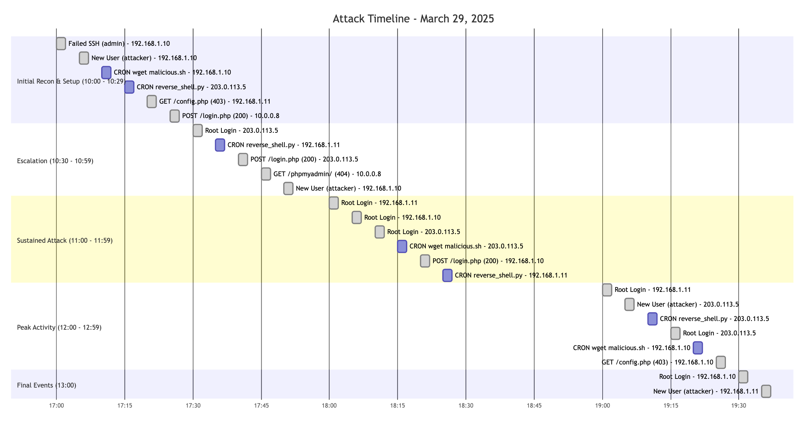

## Attack Timeline  


## Security Control Failed 
1. Weak Authentication - as you can see in the timeline and the log, the attacker login to the victim's account.
```zsh
2025-03-29T10:47:00Z,auth,203.0.113.5,Accepted password for root from 203.0.113.5 port 54321 ssh2
2025-03-29T11:06:00Z,auth,192.168.1.10,Accepted password for root from 192.168.1.10 port 54321 ssh2
2025-03-29T11:19:00Z,auth,192.168.1.11,Accepted password for root from 192.168.1.11 port 54321 ssh2
2025-03-29T12:41:00Z,auth,203.0.113.5,Accepted password for root from 203.0.113.5 port 54321 ssh2
```
2. No Brute Force Protection - attacker tried has failed attempts followed by a successful login.
```zsh
2025-03-29T10:01:00Z,auth,192.168.1.10,Failed password for invalid user admin from 192.168.1.10 port 45678 ssh2
2025-03-29T10:41:00Z,auth,203.0.113.5,Failed password for invalid user admin from 203.0.113.5 port 45678 ssh2
2025-03-29T10:42:00Z,auth,203.0.113.5,Failed password for invalid user admin from 203.0.113.5 port 45678 ssh2
```

3. Weak User Management - attacker can easily create a new accounts across all systems.
```zsh
2025-03-29T10:01:00Z,auth,192.168.1.10,"new user: name=attacker, UID=1001, GID=1001"
2025-03-29T10:06:00Z,auth,192.168.1.11,"new user: name=attacker, UID=1001, GID=1001"
2025-03-29T10:24:00Z,auth,192.168.1.10,"new user: name=attacker, UID=1001, GID=1001"
2025-03-29T12:05:00Z,auth,203.0.113.5,"new user: name=attacker, UID=1001, GID=1001"
2025-03-29T12:20:00Z,auth,10.0.0.8,"new user: name=attacker, UID=1001, GID=1001"
```

4. Inadequate CRON Job Controls - Malicious cron job was easily added and executed
```zsh
2025-03-29T10:02:00Z,cron,192.168.1.10,CRON job added by attacker
2025-03-29T10:29:00Z,cron,203.0.113.5,CRON job added by attacker
2025-03-29T11:35:00Z,cron,192.168.1.10,CRON job added by attacker
2025-03-29T10:00:00Z,cron,192.168.1.10,CRON job started: wget malicious.sh
2025-03-29T10:02:00Z,cron,203.0.113.5,CRON executed reverse_shell.py
```

5. Web Application Exposure - attacker can easily access the restricted web applications.
```zsh
2025-03-29T10:19:00Z,access,192.168.1.10,GET /config.php HTTP/1.1 - 403
2025-03-29T10:53:00Z,access,10.0.0.8,GET /phpmyadmin/ HTTP/1.1 - 404
2025-03-29T10:10:00Z,access,10.0.0.8,POST /login.php HTTP/1.1 - 200
2025-03-29T10:35:00Z,access,203.0.113.5,POST /login.php HTTP/1.1 - 200
```

6. Poor Network Segmentation Controls - attacker can spread across different networks.

## Recommend Preventive Measures
1. Implement SSH Hardening and Public Key Authentication
- Generate 4096-bit RSA or ED25519 keys: ssh-keygen -t ed25519 -a 100
- Disable password authentication 
- Restrict user access via AllowUsers directive in SSH config
- Use `fail2ban` to block malicious IPs

2. Implement Strict User Control
- Implement role-based access control (RBAC)
- Create dedicated service accounts with minimal permissions

3. Deploy Network Segment in Security Zone
- Create distinct network zones (DMZ, application, database, management)
- Implement zero-trust architecture principles
- Deploy internal firewalls between zones with explicit allow rules

